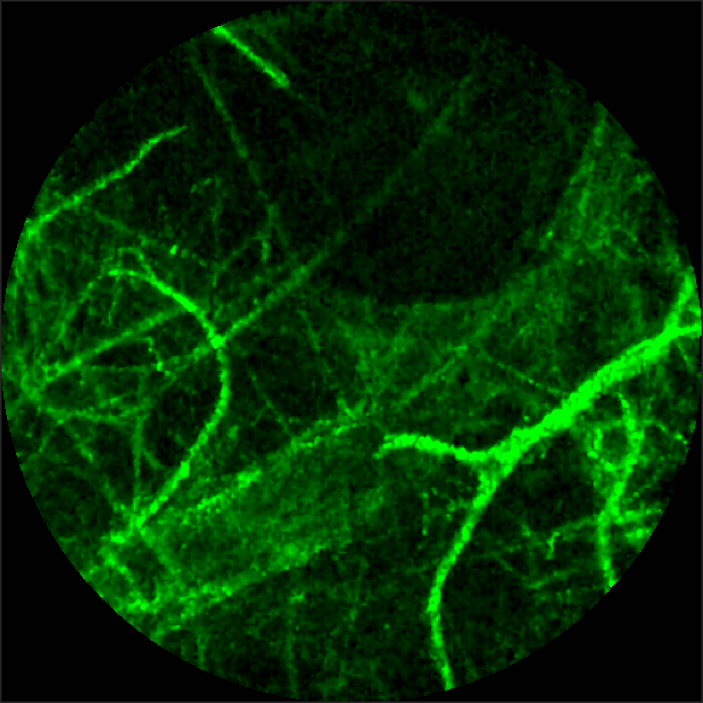
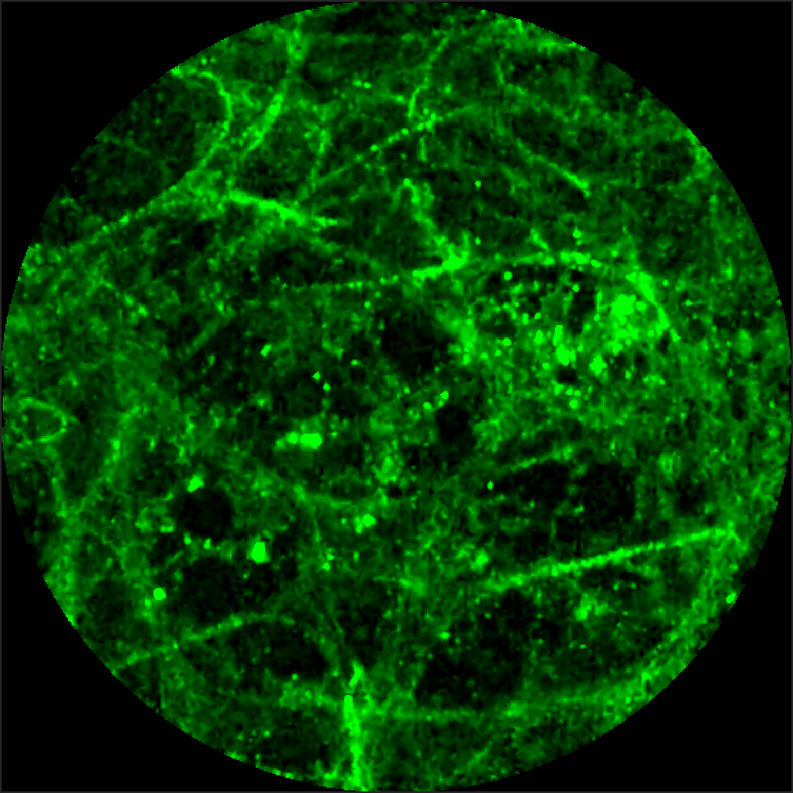

## Estimating Bacterial and Cellular Load in FCFM Imaging

We address the task of estimating bacterial and cellular load in the human distalung with fibered confocal fluorescence microscopy (FCFM). In pulmonary FCFM some cells can display autofluorescence, and they appear as disc like objects in the FCFM images, whereas bacteria, although not autofluorescent, appear as bright blinking dots when exposed to a targeted smartprobe.  Estimating bacterial and cellular load becomes a challenging task due to the presence of background from autofluorescent human lung tissues, i.e., elastin, and imaging artifacts from motion etc. We create a database of annotated images for both these tasks where bacteria and cells were annotated, and use these databases for supervised learning. We extract image patches around each pixel as features, and train a classifier to predict if a bacterium or cell is present at that pixel. We apply our approach on two datasets for detecting bacteria and cells respectively. For the bacteria dataset, we show that the estimated bacterial load increases after introducing the targeted smartprobe in the presence of bacteria. For the cell dataset, we show that the estimated cellular load agrees with a clinician’s assessment.

Without bacteria             |  With bacteria
:-------------------------:|:-------------------------:
  |  

Dependencies
---
Download the relevant code and add to the Matlab path  
[non-maximal suppression](https://pdollar.github.io/toolbox/)  
[fkmeans](https://uk.mathworks.com/matlabcentral/fileexchange/31274-fast-k-means/)  
[logistic regression](https://github.com/quinnliu/machineLearning/tree/master/supervisedLearning/logisticRegression)  

Running experiments
---
1. Run `scripts/s1_annotate` to annotate a set of images manually by clicking on the objects.
2. Run `scripts/s2_extractFeatures` to extract positive and negative images patches as features, and divide the image patches in training and validation folds.
3. Run `scripts/s3_learnModel` to learn a radial basis function classifier on each training fold.
4. Run `scripts/s4_evaluate` to evaluate validation performance of the classifiers on corresponding validation fold.
5. Run `scripts/s5_annotateTest` to annotate objects in test images.

Generating figures
---
Run `plots/plotList` to generate figures presented in the article.

Reference  
---
```bibtex
@article{seth_estimating_2018,
	title = {Estimating {Bacterial} and {Cellular} {Load} in {FCFM} {Imaging}},
	volume = {4},
	copyright = {http://creativecommons.org/licenses/by/3.0/},
	url = {http://www.mdpi.com/2313-433X/4/1/11},
	doi = {10.3390/jimaging4010011},
	number = {1},
	journal = {Journal of Imaging},
	author = {Seth, Sohan and Akram, Ahsan R. and Dhaliwal, Kevin and Williams, Christopher K. I.},
	month = jan,
	year = {2018},
	pages = {11},
}
```
